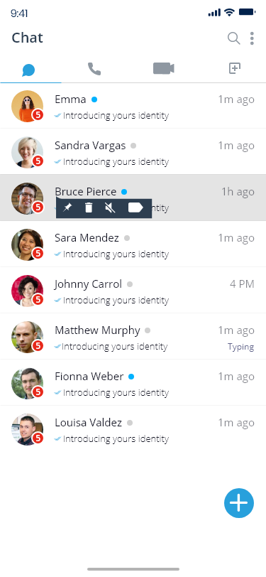

# GlobalTalk - A Skype Alternative to Call International Numbers Worldwide

  

[](https://opensource.org/licenses/MIT)
[](CONTRIBUTING.md)
[](https://github.com/liveupx/A-Skype-alternative-to-call-international-numbers-worldwide/stargazers)

**GlobalTalk** is an open-source alternative to Skype that specializes in international calling. Our mission is to provide affordable, high-quality international calls to both mobile and landline numbers worldwide, with transparent pricing and superior audio quality.

## 🌍 [View Demo](https://liveupx.com)

 
 

## ✨ Features

- **Crystal-Clear International Calls**: HD voice quality when calling international numbers
- **Global Coverage**: Call 230+ countries and territories worldwide
- **Affordable Rates**: Up to 80% cheaper than Skype and traditional carriers
- **No Hidden Fees**: Transparent pricing with all costs shown upfront
- **Multi-Platform Support**: Available on iOS, Android, Windows, and macOS
- **Advanced Security**: End-to-end encryption for all calls
- **Low Bandwidth Mode**: Make quality calls even with poor connection
- **Smart Call Routing**: Optimized pathways for better international call quality
- **Contact Sync**: Easily import your existing contacts
- **Call Recording**: Save important conversations (with consent)
- **Simple API**: Integrate calling features into your own applications

## 🚀 Technology Stack

- **Frontend**: React, Redux, TailwindCSS
- **Backend**: Node.js, Express
- **Real-time Communication**: WebRTC, TURN/STUN servers
- **Call Infrastructure**: Asterisk, FreeSWITCH
- **Database**: PostgreSQL, Redis
- **Authentication**: JWT, OAuth2
- **DevOps**: Docker, Kubernetes, GitHub Actions
- **Testing**: Jest, Cypress

## 📋 Requirements

- Node.js 18.x or higher
- npm 8.x or higher
- PostgreSQL 14.x or higher
- Docker (optional, for containerized setup)

## 🔧 Installation

### Quick Setup

```bash
# Clone the repository
git clone https://github.com/liveupx/A-Skype-alternative-to-call-international-numbers-worldwide.git globaltalk

# Navigate to project directory
cd globaltalk

# Install dependencies
npm install

# Copy example environment file
cp .env.example .env

# Set up your environment variables in .env file
# Especially focus on setting up your PostgreSQL connection and SIP trunk credentials

# Run database migrations
npm run migrate

# Start the development server
npm run dev
```

### Docker Setup

```bash
# Build and start containers
docker-compose up -d

# The app will be available at http://localhost:3000
```

## 📱 Mobile App Setup

```bash
# Navigate to mobile directory
cd mobile

# Install dependencies
npm install

# For iOS
cd ios && pod install && cd ..
npm run ios

# For Android
npm run android
```

## 🔑 Environment Variables

Copy the `.env.example` file to a new file called `.env` and update the variables:

```
# App Configuration
PORT=3000
NODE_ENV=development
APP_SECRET=your_app_secret_key

# Database Configuration
DB_HOST=localhost
DB_PORT=5432
DB_NAME=globaltalk
DB_USER=postgres
DB_PASSWORD=your_password

# SIP Trunk Configuration
SIP_PROVIDER=your_provider
SIP_USERNAME=your_username
SIP_PASSWORD=your_password
SIP_SERVER=your_server

# Redis Configuration
REDIS_HOST=localhost
REDIS_PORT=6379
REDIS_PASSWORD=optional_password
```

## 🔌 VoIP Provider Integration

GlobalTalk requires a VoIP provider to connect with international phone networks. We recommend:

1. Twilio
2. Vonage (formerly Nexmo)
3. Plivo

Follow the provider-specific instructions in the `docs/voip-setup/` directory.

## 📘 Usage

### Making Your First Call

1. Sign up or log in to your GlobalTalk account
2. Add credit to your account or select a subscription plan
3. Enter the international phone number you want to call (include country code)
4. Click the call button and enjoy your crystal-clear international call

### API Usage Example

```javascript
import { GlobalTalkClient } from 'globaltalk-api';

// Initialize the client
const client = new GlobalTalkClient({
  apiKey: 'your_api_key',
  apiSecret: 'your_api_secret'
});

// Make a call
client.makeCall({
  to: '+44123456789',
  from: '+12024561111',
  callbackUrl: 'https://your-app.com/call-status'
})
.then(call => console.log(`Call initiated with ID: ${call.id}`))
.catch(error => console.error('Error initiating call:', error));
```

## 🌟 Contributing

We welcome contributions to GlobalTalk! Please see our [Contributing Guidelines](CONTRIBUTING.md) for more details on how to get involved.

### Development Workflow

1. Fork the repository
2. Create a feature branch: `git checkout -b feature/amazing-feature`
3. Commit your changes: `git commit -m 'Add amazing feature'`
4. Push to the branch: `git push origin feature/amazing-feature`
5. Open a Pull Request

### Code Style

We use ESLint and Prettier to ensure code quality. Please run:

```bash
# Check code style
npm run lint

# Fix code style issues
npm run lint:fix
```

## 🔒 Security

Security is critical for a telecommunications application. If you discover any security issues, please report them by sending an email to info@liveupx.com instead of opening a public issue.

## 📜 License

This project is licensed under the MIT License - see the [LICENSE](LICENSE) file for details.

## 🙏 Acknowledgements

- Thanks to all our [contributors](https://github.com/liveupx/A-Skype-alternative-to-call-international-numbers-worldwide/graphs/contributors)
- WebRTC community for making browser-based calling possible
- Asterisk and FreeSWITCH for providing open-source VoIP switching
- All the open-source libraries that make this project possible

## 📊 Project Status

GlobalTalk is currently in beta. We're actively developing new features and improving existing ones. Check our [roadmap](ROADMAP.md) for upcoming features or join our [Discord community](https://discord.gg/globaltalk) to discuss the project.

## 📞 Contact

- Website: [https://Liveupx.com](https://liveupx.com)
- Email: info@liveupx.com
- Twitter: [@Liveupx](https://twitter.com/liveupx)
- Discord: [Liveupx Community](https://discord.gg/liveupx)

<p align="center">
  
  <br>
  <em>Developed with ❤️ by <a href="https://liveupx.com">LiveupX</a></em>
</p>

---

<p align="center">
  <sub>Built with ❤️ by the Liveupx.com team and open-source community</sub>
</p>
